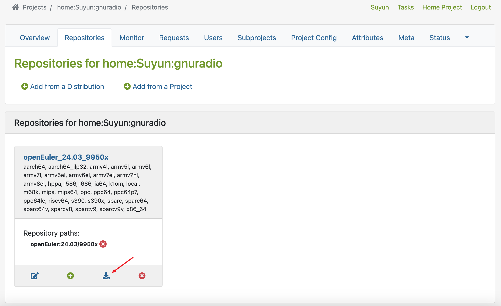

# 通过 EUR 向 openEuler 引入软件包

本文主要介绍如何通过软件包贡献平台和 EUR 向 openEuler 引入软件包。

首先，使用 openEuler ID 登录 [软件包贡献平台](https://software-pkg.openeuler.org/zh/package)。

如果是第一次使用的话，需要注册一个 openEuler ID，并在注册完成后在帐号「个人中心」的「帐号绑定」中绑定 Gitee 帐号。同时需要注意的是注册时需要使用分配的软件所邮箱。

登录之后点击右上角的「贡献软件包」开始填写信息。

- 名称：填写软件包的名称。
- 简介：填写软件包的简介，建议（但不是必须）与软件包 spec 的 `Desription`  一致。
- 目的：填写引入软件包的目的，如「openEuler RISC-V 引入此包。」
- Upstream：填写软件包上游 URL，如 GitHub / Gitee 链接等，可以不与 spec 的 `URL` 一致。

> ⚠️ 以下两个字段 **非常重要**，关系到构建成功与否，且不可修改。如果填写错误只能关闭申请后重新申请。

- Spec：填写 spec 文件的链接，需要可以直接下载，如 Gitee 仓库中对应文件的 raw 链接（注意是 raw 链接而不是预览链接，本文作者就曾经踩过这个坑）。
- SPRM：填写构建系统生成的 `.src.rpm` 文件（源码包）的链接，如在 OBS 上构建成功后生成的文件的链接。

> 在 OBS 上，可以在 project 主页的「Repositories」选项卡中，点击所需的 Repository 区域的「Download Repository」按钮（左数第三个按钮，如下图红色箭头所示），然后出现的目录的 `src` 目录下即可找到对应的 `.src.rpm` 文件。
>
> 

> 以 [ocfs2-tools](https://software-pkg.openeuler.org/zh/package-detail/676a6cf09865a0c0ddf887cb) 软件包为例。本文作者在引入该软件包时，在 Gitee 上创建了一个 [仓库](https://gitee.com/Suyun114/ocfs2-tools) 来存放 spec 和源码，在 OBS 上的 `home:Suyun` project 中创建了 `ocfs2-tools` package 并进行了构建 。那么在软件包贡献平台上填写信息时，应该填写：
>
> - Spec：`https://gitee.com/Suyun114/ocfs2-tools/raw/master/ocfs2-tools.spec`
> - SRPM：`https://build-repo.tarsier-infra.isrc.ac.cn/home:/Suyun/24.03/src/ocfs2-tools-1.8.8-1.oe2403.src.rpm`

接下来的部分：

- SIG：已经填写为 ecopkg 且无法修改。
- 仓库地址：可以选择 GitHub 和 Gitee，一般选择 Gitee。
- Committers：填写自己的 Gitee 帐号。

然后点击「提交」，如果顺利的话申请会被创建，同时新申请的软件包会显示在软件包贡献平台主页的「审批中」选项卡。可以积极刷新页面查看申请状态。

刚开始，申请的状态为 CI-WAITING，表示软件包贡献平台正在按照填写的 Spec 和 SRPM 地址下载软件包的 spec 文件和源码包。如果长时间处于 CI-WAITING，说明 Spec 和 SRPM 填写错误，需要关闭申请后重新申请。

如果下载成功，状态将变为 CI-BUILDING，表示 CI 构建正在进行。此时详情页面的 Spec 和 SRPM 信息旁边的下载图标会变得可以点击，可以点击下载以确认填写的信息正确与否。

构建完成后，状态会根据构建成功或失败变为 CI-PASSED 或 CI-FAILED，同时页面下半部的「操作日志」会显示 CI 的具体输出，其格式与向 src-openeuler 提交 PR 时的门禁信息是一致的，且可以点击「Build Details」栏的链接查看更详细的信息。

如果 CI-FAILED，且不需要修改 Spec 和 SRPM（比如只是缺失依赖），可以在修正问题后点击「重新运行CI」，否则需要关闭申请后，重新申请并填写新的 Spec 和 SRPM（如果使用的是 Gitee 和 OBS 等会自动更新链接对应文件的平台，也可以点击「修改」按钮后勾选「重新下载SPEC」或「重新下载SRPM」）。

> 更新于 2025.1.29：近期软件包贡献平台在点击「重新运行CI」后会提示 500 错误，这种情况只能关闭申请后再重新申请。

如果 CI-PASSED，则需要等待 owner 成员同意申请。同意后软件包即引入成功。

> 需要注意的是，软件包引入成功并不代表新引入的软件包会被立刻构建。如果在引入一个软件包后还需要引入依赖该软件包的其他软件包，需要在引入其他软件包之前通过 mentor 联系 openEuler 构建新引入的软件包到 master，才能在引入其他软件包时确保门禁通过。

---

因软件包贡献平台 session 过期时间疑似较短，如果反复出现在信息填写好点击「提交」后提示登录的情况，则可以考虑先将软件包在 EUR 上构建，再通过 EUR 提交到软件包贡献平台。

首先，使用 openEuler ID 登录 [EUR](https://eur.openeuler.openatom.cn/coprs/)。点击「New Project」新建一个项目，一般来说只需要填写 Project Name 和 Chroots。

然后在项目的「Package」选项卡中点击「New package」新建软件包，一般来说只需要填写 Package name 和 Clone url。

新建软件包之后进入软件包的详情页，点击右上角的「Rebuild」按钮进行构建。

在构建至少成功一次后，点击右上角的「Add to openEuler」，会跳转到软件包贡献平台。此时会自动填写包括 Spec 和 SRPM（均使用 EUR 上的）在内的部分信息，需要额外填写的信息有「目的」、「Upstream」、「仓库地址」和「Committers」。填写完提交之后的步骤与上文一致。
