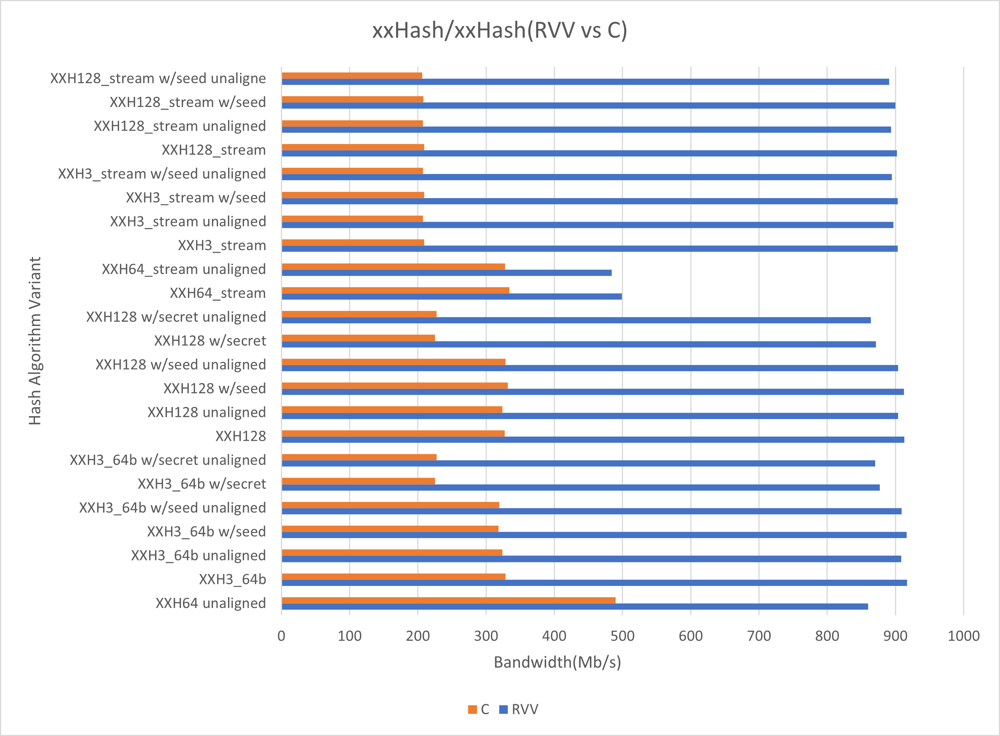

# 2025 年 6 月进展 - 实习生

实习生进展月度汇总

<!-- 格式：

## 姓名

### 感悟思考

### 外部可见交付 （指已合并PR，未合并pr需要询问mentor是否可以计算，并且在下个月不能计算）

远程可见交付：

| 关联 issue 链接    | Issue 类型和简介（如修复xxx，升级xxx） | 外部 PR 或相关工程链接 | 是否关闭 issue 及未关闭 issue 原因 | mentor 评价（本月可以没有） |
| ------------------ | -------------------------------------- | ---------------------- | ---------------------------------- | --------------------------- |
| 线下坐班天数备注： |                                        |                        |                                    |                             |

### 正在进行的尝试/未来的计划

  -  -->

## [王尧勇](../../Intern/intern_message.md#王尧勇)

### 感悟思考

- 本月学校课程和导师任务接近收尾，之后会有更多的时间投入实习工作。
- 尝试了很多镜像测试任务，发现 oerv 的 ISO 镜像逐渐成熟，之后可以直接 ISO 安装到 qemu 来测试 rear 功能，也可以尝试直接生成 rear 的 ISO 恢复镜像，而非直接生成 qemu 格式镜像。
- 学习了 opensbi 的部分源码，尝试编写了一个简单的内核启动代码来测试通过 sbi 设置物理时钟的功能。学习了荔枝派 4A 的镜像烧录流程和系统启动引导流程。
- 之前自制的命令行 agent 工具对阅读项目和文档帮助很大，大大提高了效率。

### 外部可见交付 （指已合并PR，未合并pr需要询问mentor是否可以计算，并且在下个月不能计算）

| 关联 issue 链接 | Issue 类型和简介（如修复xxx，升级xxx） | 外部 PR 或相关工程链接 | 是否关闭 issue 及未关闭 issue 原因 | mentor 评价（本月可以没有） |
| --------------- | -------------------------------------- | ---------------------- | ---------------------------------- | -------------------------- |
| [issue1845](https://github.com/openeuler-riscv/oerv-team/issues/1845) | \[oerv_24.03SP2\] 特性测试-openssl 并新增测试方法和步骤文档 | [oerv-qa/pr84](https://github.com/openeuler-riscv/oerv-qa/pull/84) | 是 | N/A |
| [issue1846](https://github.com/openeuler-riscv/oerv-team/issues/1846) | \[oerv_24.03SP2\] 特性测试-GreatSQL 并新增测试方法和步骤文档 | [oerv-qa/pr84](https://github.com/openeuler-riscv/oerv-qa/pull/84) | 是 | N/A |
| [issue1904](https://github.com/openeuler-riscv/oerv-team/issues/1904) | 24.03SP2 everything ISO 安装测试 | N/A | 是 | N/A |
| [issue1921](https://github.com/openeuler-riscv/oerv-team/issues/1921) | 24.03SP2 standard ISO安装测试 | N/A | 是 | N/A |
| [issue1925](https://github.com/openeuler-riscv/oerv-team/issues/1925) | 24.03SP2 lpi4a 镜像测试 | N/A | 是 | N/A |

### 正在进行的尝试/未来的计划
- HMCL 新版本添加了很多新功能，尝试升级原有的构建仓库中的版本。
- 继续学习 sbi 相关知识。

## [罗君](../../Intern/intern_message.md#罗君)

### 感悟思考

### 外部可见交付 （指已合并PR，未合并pr需要询问mentor是否可以计算，并且在下个月不能计算）

### 正在进行的尝试/未来的计划

## [郝逸飞](../../Intern/intern_message.md#郝逸飞)

### 感悟思考
这个月忙着期末和论文的事情，感觉有了合适的 task 也常常被其他同学捷足先登了，所以产出很低，不过依然从这些任务里学到了零星的知识
### 外部可见交付
| 关联 issue 链接 | Issue 类型和简介（如修复xxx，升级xxx） | 外部 PR 或相关工程链接 | 是否关闭 issue 及未关闭 issue 原因 | mentor 评价（本月可以没有） |
| --------------- | -------------------------------------- | ---------------------- | ---------------------------------- | -------------------------- |
| [#1849](https://github.com/openeuler-riscv/oerv-team/issues/1849) | 特性测试-sysMaster和devmaster | https://github.com/openeuler-riscv/oerv-qa/pull/90 https://github.com/openeuler-riscv/oerv-qa/pull/77 | 是 
| [#1912](https://github.com/openeuler-riscv/oerv-team/issues/1912) | 特性测试-sysmonitor | https://github.com/openeuler-riscv/oerv-qa/pull/87 https://gitee.com/src-openeuler/sysmonitor/issues/ICIX0Y | 是 |
| [#1913](https://github.com/openeuler-riscv/oerv-team/issues/1913) | 特性测试-syscare | https://github.com/openeuler-riscv/oerv-qa/pull/89 https://gitee.com/src-openeuler/syscare/issues/ICIX32| 是 |

### 未来计划
进行 ospp 项目的开发工作
## [李金哲](../../Intern/intern_message.md#李金哲)

### 感悟思考
- 为了更好的指导jailhouse到RISC-V的移植，这个月对RISC-V的虚拟化和实现进行了具体的学习，基本能够将虚拟化的要求和具体的操作对应起来。
- 这个月开始了对微内核OS到RISC-V的移植，正在参考rcore的教程学习基于rust的os开发。
- 同时，计划在移植的OS中添加对penglai的支持，即penglai sdk+和penglai sbi。rustsbi目前还没有penglai相关的工作，计划和洛佳老师沟通一下参与到rustsbi支持penglai sbi的工作。
### 外部可见交付
| 关联 issue 链接 | Issue 类型和简介（如修复xxx，升级xxx） | 外部 PR 或相关工程链接 | 是否关闭 issue 及未关闭 issue 原因 | mentor 评价（本月可以没有） |
| --------------- | -------------------------------------- | ---------------------- | ---------------------------------- | -------------------------- |
| [oerv2403sp2 Penglai test](https://github.com/openeuler-riscv/oerv-team/issues/1848) | 在oerv2403sp2上测试penglai TEE | [penglai test report](https://github.com/openeuler-riscv/oerv-qa/pull/73) | 关闭 |  |
| [oerv2403sp2 dim test](https://github.com/openeuler-riscv/oerv-team/issues/1847) | 在oerv2403sp2上测试dim | [dim test guide](https://github.com/openeuler-riscv/oerv-qa/pull/88) | 关闭 |  |
| ospp:移植jailhouse到RISC-V |  |  |  |  |
### 正在进行的尝试/未来的计划
- 继续学习RISC-V H拓展的落地实现，并对jailhouse的工作流程进行完整的分析，准备输出到社区。
- 继续基于rust开发OS，并投入到在rustsbi中支持penglai sbi的工作。
## [尹健徽](../../Intern/intern_message.md#尹健徽)

### 感悟思考
在上个月的谈话后，本月认证思考了一下未来想做的东西，聚焦于RISCV的性能优化，比如说SIMD这类的RVV向量优化，此月也看到了有同学RVV的优化合并到上游，很厉害。我也对RVV进行了初步的了解，学习相关贡献的PR。另外测试任务也有在做，确实通过老师的指点后，对未来路径更加清晰，考虑范围也更加多一点，很好！

### 外部可见交付 （指已合并PR，未合并pr需要询问mentor是否可以计算，并且在下个月不能计算）
远程可见交付：

| 关联 issue 链接                                              | Issue 类型和简介  | 任务来源 | 解决问题                                              | 外部 PR 或相关工程链接                                       | 是否关闭 issue 及未关闭 issue 原因 |
| ------------------------------------------------------------ | ----------------- | -------- | ----------------------------------------------------- | ------------------------------------------------------------ | ---------------------------------- |
| [issue1](https://github.com/openeuler-riscv/oerv-team/issues/1852) | openGauss版本测试 | qa       | 验证数据库主要功能，发现遗留问题                      | [PR1](https://github.com/openeuler-riscv/oerv-qa/pull/71)(已合入) | 是                                 |
| [issue2](https://github.com/openeuler-riscv/oerv-team/issues/1850) | PilotGo版本测试   | qa       | pilotgo主要功能测试完毕，遗留的架构问题老师发布在ospp | [PR2](https://github.com/openeuler-riscv/oerv-qa/pull/72)(已合入) | 是                                 |
| [issue3](https://github.com/openeuler-riscv/oerv-team/issues/1851) | youqu版本测试     | qa       | 体验了自动测试框架，功能正常，确包                    | [PR3](https://github.com/openeuler-riscv/oerv-qa/pull/74)(已合入) | 是                                 |
|                                                              | 同上              | 同上     | 同上                                                  | [发现issue](https://gitee.com/openeuler/RISC-V/issues/ICF7R1#note_42669078) |                                    |
| [issue4](https://github.com/openeuler-riscv/oerv-team/issues/1794) | 跟踪CSC动态       | \        | 本月更新**3次**                                       |                                                              |                                    |

### 正在进行的尝试/未来的计划
* RVV优化基础知识机进行总结并写一个文档
* 选取比较熟悉的开源项目进行RVV优化

## [陈志康](../../Intern/intern_message.md#陈志康)

### 感悟思考

### 外部可见交付

### 正在进行的尝试/未来的计划

## [阮杨帆](../../Intern/intern_message.md#阮杨帆)

### 感悟思考

### 外部可见交付

### 正在进行的尝试/未来的计划

## [明岢岢](../../Intern/intern_message.md#明岢岢)

### 感悟思考

现在确实是很忙很忙，最近老师给了我一个华为的板子, 在上面也跑了openEuler试了试, 做了一些ros2和yolo的demo.

这个月在syscare侧有了新的方案——uprobe, 该方案其他方面都完成了, 但是中途遇到了一个难点, 第一是发现2403sp1用kprobe会有问题, 想了一个解决方案, 但是这个uprobe方案是在2403sp2之后出的, kprobe的问题已经修复了就没关注了. 第二是uprobe进行热补丁跳转的时候riscv返回用的是ra寄存器, aarch64和x86_64是通过修改ip跳转的, 这就导致了一个问题, riscv不能向其他架构那样通过设置IP返回用户态, 直接设置ra的话又会导致死循环, 于是可能中间需要使用到一个跳板, 但是这个跳板是在用户态的, 于是就要想一些办法把内核的一些参数传到用户态, 中间可能需要一点操作, 这是一点思路, 还没有很好的实现, 这一点解决之后在riscv就也有uprobe的方案了.

- https://gitee.com/jvle/syscare/tree/uprobe/

然后上次合同步syscare其他分支的PR.

- [#686](https://gitee.com/openeuler/syscare/pulls/686) [#687](https://gitee.com/openeuler/syscare/pulls/687) [#688](https://gitee.com/openeuler/syscare/pulls/688)

这个月还做了一些简单的测试任务.

### 外部可见交付

| 关联 issue 链接                                              | Issue 类型和简介  | 任务来源 | 解决问题                                              | 外部 PR 或相关工程链接                                       | 是否关闭 issue 及未关闭 issue 原因 |
| ------------------------------------------------------------ | ----------------- | -------- | ----------------------------------------------------- | ------------------------------------------------------------ | ---------------------------------- |
|https://github.com/openeuler-riscv/oerv-team/issues/1897|镜像测试|qa|测试standard IO||是|
|https://github.com/openeuler-riscv/oerv-team/issues/1901|镜像测试|qa|测试lichipi4a镜像||是|
|https://github.com/openeuler-riscv/oerv-team/issues/1907|镜像测试|qa|测试lichipi4a镜像||是|

### 正在进行的尝试/未来的计划

- 这个月学校有一个月实训.

- 抽空去跑夏令营.

## [郑丹龙](../../Intern/intern_message.md#郑丹龙)

### 感悟思考

### 外部可见交付

### 正在进行的尝试/未来的计划

## [黄丕松](../../Intern/intern_message.md#黄丕松)

### 感悟思考

### 外部可见交付

### 正在进行的尝试/未来的计划

## [祖彬朔](../../Intern/intern_message.md#祖彬朔)

### 感悟思考

### 外部可见交付

### 正在进行的尝试/未来的计划

## [李英凯](../../Intern/intern_message.md#李英凯)

### 感悟思考

### 外部可见交付

### 正在进行的尝试/未来的计划

## [顾凯杰](../../Intern/intern_message.md#顾凯杰)

### 感悟思考

### 外部可见交付

### 正在进行的尝试/未来的计划

## [邱文键](../../Intern/intern_message.md#邱文键)

### 感悟思考
这个月有继续保持写博客的习惯，输出了八篇博客，主要是英文博客，值得高兴的是，有人私信我，对这方面的内容很感兴趣，这点另外很开心。

### 外部可见交付
| 关联 issue 链接 | Issue 类型和简介（如修复xxx，升级xxx） | 外部 PR 或相关工程链接 | 是否关闭 issue 及未关闭 issue 原因 | mentor 评价（本月可以没有） |
| --------------- | -------------------------------------- | ---------------------- | ---------------------------------- | -------------------------- |
| https://medium.com/@wenjianqiu5/final-year-project-handwritten-numpy-in-c-and-porting-to-risc-v-in-memory-of-my-internship-793371f2d0cc | | | | |
| https://medium.com/@wenjianqiu5/exploring-solana-compilation-failures-on-openeuler-risc-v-7ee88d3bb84e | | | | |
| https://medium.com/@wenjianqiu5/osmts-one-stop-management-test-script-for-openeuler-risc-v-11c91550523f | | | | |
| https://medium.com/@wenjianqiu5/painless-deployment-of-solidity-on-openeuler-risc-v-9afe915e3a8a | | | | |
| https://medium.com/@wenjianqiu5/openeuler-risc-v-interest-exploration-emulator-porting-f29a812c8d63 | | | | |
| https://medium.com/@wenjianqiu5/you-can-also-play-mc-on-oerv-part-1-f6cee6ef00ce | | | | |
| https://medium.com/@wenjianqiu5/you-can-also-play-mc-on-oerv-part-2-4bbb24d4828e | | | | |
| https://medium.com/@wenjianqiu5/iozone-example-for-disk-i-o-performance-testing-on-openeuler-risc-v-a8c47b4fcd55 | | | | |

### 正在进行的尝试/未来的计划
之前也有出版社联系过我，想收录我的文章或者合作之类的，加上我自己对写作也感兴趣，所以想进一步开拓一下。

## [林子予](../../Intern/intern_message.md#林子予)

### 感悟思考

本月个人事务繁忙，无可见交付但依然有在推进 task。

[#1677](https://github.com/openeuler-riscv/oerv-team/issues/1677) 已经基本跑通了流程。但因为补丁缺失，当前正在重新构建，且构建一次需要接近两天。完成后会写一篇 case。

[#1896](https://github.com/openeuler-riscv/oerv-team/issues/1896) 在尝试了多种方案后，最终决定在同一台 x86 机器上使用相同配置的 QEMU 虚拟机进行测试数据的收集，目前正在进行。

### 外部可见交付

无。

### 正在进行的尝试/未来的计划

- 完成 ghc bootstrap，写一篇 case。
- 完成各种发行版 unixbench 测试数据的收集。

## [邱志磊](../../Intern/intern_message.md#邱志磊)

### 感悟思考

### 外部可见交付 （指已合并PR，未合并pr需要询问mentor是否可以计算，并且在下个月不能计算）

### 正在进行的尝试/未来的计划

## [张宏涛](../../Intern/intern_message.md#张宏涛)

### 感悟思考

### 外部可见交付

### 正在进行的尝试/未来的计划

## [王跃翔](../../Intern/intern_message.md#王跃翔)

### 感悟思考

### 外部可见交付

### 正在进行的尝试/未来的计划

## [袁驰程](../../Intern/intern_message.md#袁驰程)

### 感悟思考

### 外部可见交付

### 正在进行的尝试/未来的计划

## [施安吉](../../Intern/intern_message.md#施安吉)

### 感悟思考

### 外部可见交付 

### 正在进行的尝试/未来的计划

## [贾林](../../Intern/intern_message.md#贾林)

### 感悟思考

​	本月的工作量比较饱满，修包也终于实现了零的突破，也有一些pr被合并，需要注意的问题就是提交pr的时候注意规范，不要遗漏细节，方便社区进行review。

​	修复promu包积累了很多经验，也踩了一些坑，记录在修包案例里了，大家有兴趣看看。本月修复的CGO相关的包，都是以此为基础的，正因为这里积累了很多经验知识，后面修复这种类型的包才比较顺利。riscv64下开启cgo，整个尝试流程，基本就是spec设置环境变量，makefile设置环境变量，再比较特殊的就是在代码里面控制cgo的开启与否，遇见promu进行构建的项目，往往会修改.promu.yml配置文件，它其实是传递给promu的，promu项目的代码里面有结构体会接收cgo参数，设置这个结构体才会生效。之前以为，修包工作，看着pr好像变动很少，甚至才几行，可能很容易。实际完成以后才发现，修包也是需要知识进行支撑的，有知识经验，还要不断地尝试、试错，最终才能以比较简单的方式完成更改，这里面的过程并不像看起来那么简单。

​	另外一个工作就是ccb的探索和开发，一开始还以为它不支持ubuntu或者其他平台，后来发现，spec文件会指导软件包进行安装，也就是说，只要安装需要的文件齐全，换个发行版安装也是完全没问题的。但是，不能是利用工具把rpm包转换成deb，那样安装会有问题，正确的做法是自己执行make install需要的操作。开发工作其实也并不是那么顺利，输入输出到控制台的东西，看着好像字符串的长度和内容都一样，实际是看不见的坑。一开始完全没想到是代码里面提取镜像hash的问题，只知道一个看起来就有问题的写法竟然能正常运行，以至于我得在代码里面单独处理那个有问题的写法，最后还是老师提醒我简化代码，又调试输出才发现问题，最后才得以简化。后面增加架构的开发，遇见的问题就是riscv64下git支持不完善吧，没有git lfs子命令。收获的经验就是写代码要尽量严谨，要考虑各种特殊或者极端的情况进行处理，不然很容易写出质量低的代码。

​	修包过程中，发现比较繁琐的一点就是，如果需要添加补丁的话，需要自己解压源文件进行修改，然后利用git控制版本，生成补丁，再把补丁复制到源码仓的本地克隆，再修改spec文件之类的，提交到gitee，然后在eulermaker网站以及build网站构建来验证。这整个过程，都是纯手工的，如果一次修改不成，还要重复做一些操作。还有一点就是，如果遇见比较复杂的情况，可能会有好几种修包思路，但是只能串行验证的话，也比较繁琐和耽误时间。虽然可以注册多个账号同时进行构建，但是手工操作还是比较麻烦。不知道有没有什么方法可以简化整个流程，以提高效率。

​	md图片上传器：

 这里推荐本人的一个github项目：[yyjeqhc/blog_changer: 自动上传md文件中的图片到博客园或者github](https://github.com/yyjeqhc/blog_changer)

​	本人写博客一般是使用md文件格式，这样的话传到博客园就很方便。它最初是为了把md文档的图片自动上传到博客园而进行开发的。后来发现，github的issue评论，也可以直接复制粘贴一整个md文档，但是如果图片太多的话，自己手动复制粘贴就很繁琐。所以为了方便起见，对项目进行了扩展，github分支就是针对github的issue评论自动上传图片进行开发的。它会要求输入一个本地md文档的地址，然后解析内容，把图片上传到github后获取图片url，替换本地的图片地址，最后生成新的md文档，把新的md文档复制到issue评论区就好了。大家有兴趣可以看看。具体使用过程还是看readme。

​	开源之夏：

​	非常遗憾，没有中选。虽然后来发现那个题目不一定合适。要是早点定方向就好了，早点定方向的话，就会选一个容器相关的题目，那样会更契合以后的工作内容，也能投入更多来争取机会。现在的话，就只有明年夏天可能会有时间再来一次，更大的可能是以后就没有机会了。错失证书，这个挺遗憾。

​	一些建议：

​	希望开源之夏也能开两轮来选择课题，每人一轮投一次就好了，今年这个投项目模式的变化，还是不太友好吧。分两轮投，中间隔一周，也够第一轮的项目选人了。有些项目就应该第一轮赶紧选好人做，现在这样，让所有项目统一时间开始做，其实有点耽误时间了。（虽然，有些项目可以早就定好人，然后提前做）

### 外部可见交付 

远程可见交付：

| 关联 issue 链接                                              | Issue 类型和简介（如修复xxx，升级xxx）  | 外部 PR 或相关工程链接                                       | 是否关闭 issue 及未关闭 issue 原因 | mentor 评价（本月可以没有）   |
| ------------------------------------------------------------ | --------------------------------------- | ------------------------------------------------------------ | ---------------------------------- | ----------------------------- |
| [在 25.03 上测试 k3s · Issue #1789 · openeuler-riscv/oerv-team](https://github.com/openeuler-riscv/oerv-team/issues/1789) | 在25.03上测试k3s                        |                                                              | 任务完成，已关闭                   |                               |
| [在 25.03 上测试 secPaver · Issue #1773 · openeuler-riscv/oerv-team](https://github.com/openeuler-riscv/oerv-team/issues/1773) | 在25.03上测试secpaver                   |                                                              | 任务完成，已关闭                   |                               |
| [性能测试工具调研-OpenSSL，jmeter，wrk，Apache Bench · Issue #1857 · openeuler-riscv/oerv-team](https://github.com/openeuler-riscv/oerv-team/issues/1857) | 性能测试工具调研                        | [1857_test_reports：OpenSSL/JMeter/wrk/ab 可用性与关键性能指标调研 by yyjeqhc · Pull Request #1 · openeuler-riscv/RAVA](https://github.com/openeuler-riscv/RAVA/pull/1) | 任务完成，已关闭                   |                               |
| [修复master的promu · Issue #1877 · openeuler-riscv/oerv-team](https://github.com/openeuler-riscv/oerv-team/issues/1877) | 修复master的promu                       | https://gitee.com/src-openeuler/promu/pulls/26               | 任务完成，已关闭                   |                               |
| [rebase 2403sp2的stratovirt · Issue #1880 · openeuler-riscv/oerv-team](https://github.com/openeuler-riscv/oerv-team/issues/1880) | 补丁冲突，进行重做                      | https://gitee.com/src-openeuler/stratovirt/pulls/137         | 未关闭，社区没有review             | 赶不上2403sp2了，合并会有困难 |
| [研究 gnome-disk-utility 为什么会崩溃 · Issue #1889 · openeuler-riscv/oerv-team](https://github.com/openeuler-riscv/oerv-team/issues/1889) | 修复gnome-disk-utility                  | https://gitee.com/src-openeuler/gnome-disk-utility/pulls/13  | 任务完成，已关闭                   |                               |
| https://gitee.com/openeuler/docs-centralized/pulls/15354     | 轻量级pr，修复文档                      |                                                              | pr已合并                           |                               |
| [探索 ccb 完成 pretask 并写出教学文章及反馈问题 · Issue #1890 · openeuler-riscv/oerv-team](https://github.com/openeuler-riscv/oerv-team/issues/1890) | 探索EulerMake构建工具ccb的使用          | [ccb工具的简单使用说明介绍 by yyjeqhc · Pull Request #1891 · openeuler-riscv/oerv-team](https://github.com/openeuler-riscv/oerv-team/pull/1891) | 任务完成，已关闭                   |                               |
| [修复master的containernetworking-plugins · Issue #1892 · openeuler-riscv/oerv-team](https://github.com/openeuler-riscv/oerv-team/issues/1892) | 修复master的containernetworking-plugins | https://gitee.com/src-openeuler/containernetworking-plugins/pulls/55 | 未关闭，社区没有review             |                               |
| [[Bonus\] 让 ccb 可以接受用户指定的本地镜像或者 tarball · Issue #1894 · openeuler-riscv/oerv-team](https://github.com/openeuler-riscv/oerv-team/issues/1894) | 加强ccb的功能，以使用本地镜像进行构建   | https://gitee.com/src-openeuler/ccb/pulls/10                 | 未关闭，社区没有review             |                               |
| [Issue](https://github.com/openeuler-riscv/oerv-team/issues/1898)1898 | 24.03SP2 edge ISO安装测试               |                                                              | 任务完成，已关闭                   |                               |
| [QEMU 镜像启动异常输出排查并解决 · Issue #1910 · openeuler-riscv/oerv-team](https://github.com/openeuler-riscv/oerv-team/issues/1910) | qemu镜像启动输出异常排查                |                                                              | 任务完成，已关闭                   |                               |
| [让 ccb 支持交叉编译 · Issue #1911 · openeuler-riscv/oerv-team](https://github.com/openeuler-riscv/oerv-team/issues/1911) | 加强ccb的功能，可以实现跨架构构建       | https://gitee.com/src-openeuler/ccb/pulls/10                 | 未关闭，社区没有review             |                               |
| [[master\]修复alertmanager的CGO_ENABLE问题 · Issue #1916 · openeuler-riscv/oerv-team](https://github.com/openeuler-riscv/oerv-team/issues/1916) | 修复alertmanager                        | https://gitee.com/src-openeuler/alertmanager/pulls/31        | 未关闭，社区没有review             |                               |
| [[master\]修复prometheus-ha_cluster_exporter的CGO_ENABLE问题 · Issue #1917 · openeuler-riscv/oerv-team](https://github.com/openeuler-riscv/oerv-team/issues/1917) | 修复prometheus-ha_cluster_exporter      | https://gitee.com/src-openeuler/prometheus-ha_cluster_exporter/pulls/11 | 任务完成，已关闭                   |                               |
| [[master\]修复k3s-plugins的CGO_ENABLE问题 · Issue #1918 · openeuler-riscv/oerv-team](https://github.com/openeuler-riscv/oerv-team/issues/1918) | 修复k3s-plugins                         | https://gitee.com/src-openeuler/k3s-plugins/pulls/17         | 未关闭，社区没有review             |                               |
| [记录第一次修复的包：promu](https://www.cnblogs.com/dayq/p/18960558) | 博客园博客，记录第一次修包流程          |                                                              |                                    |                               |

### 正在进行的尝试/未来的计划

​	实验室的任务有些多，空闲的时间比之前少很多。开源之夏没有中选，希望这几个月能参与一些其他的开源活动，比如GLCC或者腾讯犀牛鸟计划。目前比较中意的还是kata容器相关。参与其他活动的话，也会投入相应的时间和精力。

## [张天泽](../../Intern/intern_message.md#张天泽)

### 感悟思考

### 外部可见交付

### 正在进行的尝试/未来的计划

## [李子建](../../Intern/intern_message.md#李子建)

### 感悟思考
对代码进行优化时，要充分利用网络资源进行检索，查看有没有前人已经完成的工作，避免重复工作的行为。

### 外部可见交付 
在为ZSTD的xxHash模块做RVV优化时，发现该xxHash模块来自上游xxHash仓库，因此向该仓库提交RVV代码，修复了两个DDE包的构建错误，具体的内容见表格。
下图是xxHash优化前和优化后的对比图。

远程可见交付：
| 关联 issue 链接 | Issue 类型和简介（如修复xxx，升级xxx） | 外部 PR 或相关工程链接 | 是否关闭 issue 及未关闭 issue 原因 | mentor 评价（本月可以没有） |
| --------------- | -------------------------------------- | ---------------------- | ---------------------------------- | -------------------------- |
| xxHash模块提交RVV代码|优化xxHash模块在RISCV平台的表现| https://github.com/Cyan4973/xxHash/pull/1043| 已合并| |
| 为xxHash提交RISCV CI| 添加RVV的测试| https://github.com/Cyan4973/xxHash/pull/1049 | 未合并 ||
| [#1842](https://github.com/openeuler-riscv/oerv-team/issues/1842)| 修复OE的Deepin Desktop Environment 的相关包| [deepin-pw-check](https://gitee.com/src-openeuler/deepin-pw-check/pulls/22) [dtkcore](https://gitee.com/src-openeuler/dtkcore/pulls/28) | 已合并|无|
| [#1842](https://github.com/openeuler-riscv/oerv-team/issues/1842)| 修复OE的Deepin Desktop Environment 的相关包| [dtkwidget](https://gitee.com/src-openeuler/dtkwidget/pulls/29) | 未合并(构建时部分包无法满足条件)|无|
| [#1919](https://github.com/openeuler-riscv/oerv-team/issues/1919) | 修复kubekey的CGO_ENABLE问题 | https://gitee.com/src-openeuler/kubekey/pulls/30 | 未关闭(PR未review) | 无|

### 正在进行的尝试/未来的计划
在对ZSTD提交RVV的CI，由于目前使用QEMU8.2和gcc13构建测试环境，因此对RVV1.0无法完全支持，或者修改代码来适配gcc13，或者对RVV代码进行编译器检测，目前还在寻找合适的方法。
本月开始对DPDK进行优化。

## [姚鑫鹏](../../Intern/intern_message.md#姚鑫鹏)

### 感悟思考

  上个月经过与王老师沟通后我发现自己最大问题是还没有一个标准的工作流程，而且也没有确定自己的发展路线，这个月我思考了一下，我发现自己最开始对 Linux 最感兴趣的一点就是他的高度自定义的属性，所以我喜欢改一些参数让他变成自己想要的样子，但是目前现状是生态并不是那么友好，好多软件因为缺失一些底层依赖导致某些功能不能正常使用，所以我接了两个调查的任务，也是打算通过一些调查任务看看软件生态构成是什么样的，但是现在的调查进度也遇到了一些阻碍，比如我提交了 bug 对 Mozilla ，课他们的回复直接就消失了，大概率这个问题不好解决，所以我还在持续跟踪这个帖子的进度，而且自己也在空余时间看看是不是因为别的原因导致的

  本月因为我们学校开始了为期一个月的课程设计，我独自设计了整个项目的前后端部分，导致耽误了很长时间，现在还有许多问题需要处理，需要在7月11日之前提交，然后还有部分考试马上要开始，所以我仍旧没办法投入全部的精力进入 issue 的研究中，等到这个项目结束之后我会有充时间完成组内的工作，所以我打算将这个月缺失的部分都在下个月补回来

  目前为止，我对于后期的路线发展大概率是向着图形界面以及音频的性能优化以及美化和标准化方向努力，因为我愿意接触 Linux 的因主要原因就是因为它有图形界面，如果我什么操作都在命令行里，我当初就不会玩 Linux 而是一直用 Windows 了，下个月开始如果组里有相关方面的任务我会去找找看看能不能解决，然后没有的话继续我的生态调查任务

### 外部可见交付 （指已合并PR，未合并pr需要询问mentor是否可以计算，并且在下个月不能计算）

远程可见交付：
| 关联 issue 链接 | Issue 类型和简介（如修复xxx，升级xxx） | 外部 PR 或相关工程链接 | 是否关闭 issue 及未关闭 issue 原因 | mentor 评价（本月可以没有） |
| --------------- | -------------------------------------- | ---------------------- | ---------------------------------- | -------------------------- |
|https://github.com/openeuler-riscv/oerv-team/issues/902 | 调查bug原因 | https://bugzilla.mozilla.org/show_bug.cgi?id=1972506 | 未关闭，已提交 Bugzilla，但是还没得到解决，目前仍在调查中 |
|https://github.com/openeuler-riscv/oerv-team/issues/904 | 调查bug原因 | 无 | 未关闭，查到 java 导致的问题，但是还无法在本地成功修复此 bug 仍在调查中|

### 正在进行的尝试/未来的计划
  - 继续调查问题，完成上个月未完成的 issue
  - 完成这学期的学业任务
  - 继续学习 Linux 图形界面以及音频相关的知识，然后寻找有关性能优化的任务

## [左敬源](../../Intern/intern_message.md#左敬源)

### 感悟思考

### 外部可见交付 

### 正在进行的尝试/未来的计划

## [杜芳洲](../../Intern/intern_message.md#杜芳洲)

### 感悟思考
本月由于个人原因完成任务较少，下个月会尽量多完成些。

### 外部可见交付 

| 关联 issue 链接 | Issue 类型和简介（如修复xxx，升级xxx） | 外部 PR 或相关工程链接 | 是否关闭 issue 及未关闭 issue 原因 | mentor 评价（本月可以没有） |
| --------------- | -------------------------------------- | ---------------------- | ---------------------------------- | -------------------------- |

| [issue1856](https://github.com/openeuler-riscv/oerv-team/issues/1856) | 性能测试工具调研-nbench，stress-ng，FPMark，CoreMark | [https://github.com/openeuler-riscv/RAVA/pull/4](https://github.com/openeuler-riscv/RAVA/pull/4) | 否 | 老师还未检查 |

### 正在进行的尝试/未来的计划
想要尝试#1881 和#1927 这两个任务，在群里申请了，但还未被老师分配。先自己试了一下,#1881 遇到了问题，问题可能与内核编译时的配置有关，验证是否是这个问题/解决这个问题似乎比较麻烦；#1927 构建花费时间很长，正在构建。

## [李沂林](../../Intern/intern_message.md#李沂林)

### 感悟思考

这个月完成了两个测试任务，ISO镜像安装测试和OERV中性能工具的使用测试。  
sysbench是系统性能测试，和之前使用过的perf工具比较，sysbench测试的是整体性能如内存分配速度、磁盘IO速度，而perf着重于系统中具体event的性能，如可以测试执行程序时发生缺页异常的性能情况，两者可以结合使用。另外，通过netperf和iperf3两个网络性能测试工具学习了TCP、UDP相关内容，而libmicro测试系统调用性能或许可以用于内核优化的工作。

### 外部可见交付 
| 关联 issue 链接 | Issue 类型和简介（如修复xxx，升级xxx） | 外部 PR 或相关工程链接 | 是否关闭 issue 及未关闭 issue 原因 | mentor 评价（本月可以没有） |
| --------------- | -------------------------------------- | ---------------------- | ---------------------------------- | -------------------------- |
| [#1855](https://github.com/openeuler-riscv/oerv-team/issues/1855) | 性能测试工具调研-sysbench，netperf，iperf3，libmicro | https://github.com/openeuler-riscv/RAVA/pull/2 | 是 |
| [#1903](https://github.com/openeuler-riscv/oerv-team/issues/1903) | 24.03SP2 standard ISO安装测试 | | 是 |

### 正在进行的尝试/未来的计划

尝试学习RVV，SIMD指令集相关内容，未来可能希望做一些有挑战性的向量优化工作。

## [刘颜铭](../../Intern/intern_message.md#刘颜铭)

### 感悟思考
在处理复杂任务遇到困难时，思考后应及时和导师沟通，避免重复探索已知问题，减少无谓的时间消耗。

### 外部可见交付 （指已合并PR，未合并pr需要询问mentor是否可以计算，并且在下个月不能计算）
| 关联 issue 链接 | Issue 类型和简介（如修复xxx，升级xxx） | 外部 PR 或相关工程链接 | 是否关闭 issue 及未关闭 issue 原因 | mentor 评价（本月可以没有） |
| --------------- | -------------------------------------- | ---------------------- | ---------------------------------- | -------------------------- |
| [#1858](https://github.com/openeuler-riscv/oerv-team/issues/1858) | 性能测试工具调研-RAJAPerf，YCSB，Redis-benchmark，BenchmarkSQL | [https://github.com/openeuler-riscv/RAVA/pull/2](https://github.com/openeuler-riscv/RAVA/pull/3) | 是 |
| [#1899](https://github.com/openeuler-riscv/oerv-team/issues/1899) | 24.03SP2 netinst ISO安装测试 | | 是 |
| [#1906](https://github.com/openeuler-riscv/oerv-team/issues/1906) | 24.03SP2 netinst ISO 安装测试 | | 是 |

### 正在进行的尝试/未来的计划
报名并入选了开源之夏 isocut 有关项目。通过阅读文档和与导师交流，已明确问题背景并定位错误原因。

计划在完成项目既定目标的基础上，进一步为 isocut 和 Kickstart 自动安装流程开发更多具有实际价值的功能。

## [鲁邦彦](../../Intern/intern_message.md#鲁邦彦)

### 感悟思考

本月主要完成了以太网-串口测试板原理图重构及部分layout工作。主控变更为`ESP32P4`。

### 正在进行的尝试/未来的计划

#### 1. 本月投入时间

---
在2025年6月，本人工作时长为36小时左右。其中各项工作投入时间如下。

- **更新HR911130A RJ45接口为R-RJ45R08P-C000以及G2406S以减少BOM开销, 重新进行该部分电路设计及PCB layout。** 2h
- **需求更新：将主控芯片由ESP32更换为ESP32P4, 并完成其基本外围器件原理图设计。** 3h
- **协助设计Micro SD多路切换方案，增加一路千兆以太网接口，并继续完成P4外围原理图设计** 8h
- **完成RTL8367RB-VB-CG及LAN8720原理图重构，完成idc1.27mm接口封装绘制** 5h
- **完成交换机VDDL 1v1电源原理图重构；完成RJ45接口原理图重构** 3h
- **增加修改部分器件封装** 1h
- **完成CSI接口原理图** 2h
- **完成施密特触发器电路重构** 2h
- **绘制1220电池封装 调整部分电阻以减少BOM开销** 2h
- **完成交换机及p4外围器件部分layout工作** 8h

#### 2. Ethgent硬件设计产出
 
- 基于ESP32P4主控的全功能测试电路原理图
- PCB layout工作进行中。
 
### 月度工作评价

#### 李航帆

- 完成对初版原理图的迁移工作，产出 DEMO 版本的原理图设计
- 完成 DEMO 版本新增外围硬件功能实现
- 完成多轮原理图改进与可制造性优化
- 提供以太网交换机等关键器件 layout 方案

